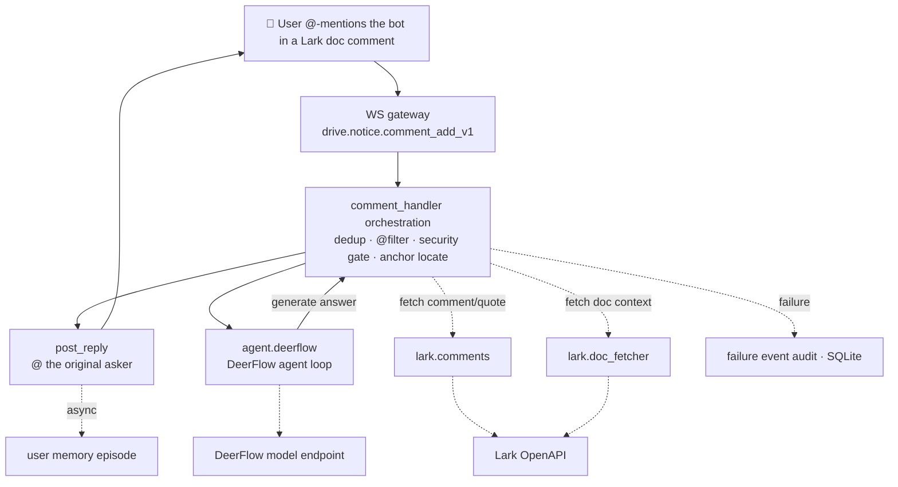

# lark-doc-whisper

English | [简体中文](README.zh-CN.md)

[](LICENSE)
[](https://www.python.org/)
[](https://docs.astral.sh/uv/)
[](https://github.com/bytedance/deer-flow)

> **Just @-mention it in a Lark/Feishu doc comment, and the answer lands right back in the thread — an AI assistant that reads the original text and remembers you.**

You're reading a doc, a question pops up, and now you have to switch windows, copy a big chunk of text into some AI, then manually explain "I meant *this* paragraph"… You've become a courier running back and forth between the doc and the AI.

lark-doc-whisper lets you **just @-mention and ask, right in the comment**: it figures out which line you highlighted and what you're talking about on its own, and the answer comes back under that very comment. No window switching, no copy-paste, no explaining the context.

> This project is built on [DeerFlow](https://github.com/bytedance/deer-flow), ByteDance's open-source deep-research agent framework. lark-doc-whisper layers Lark/Feishu doc-comment Q&A — the integration, orchestration, and safety boundaries — on top of it. If you enjoy this project, consider giving DeerFlow a star too.

## ✨ Why you'll like it

- 💬 **Ask without leaving the doc**: the question is right next to the text, and so is the answer. Reading and asking happen in the same place — your train of thought never breaks.
- ⚡ **@ it and it answers**: no waiting for scheduled scans. Mention it and it responds instantly, and it only looks at the comment you asked in — it won't dig through your other comments.
- 🔐 **You control the access**: it only works once you add it to a specific doc. No handing over a pile of long-lived permissions up front, and you can show it out whenever you want.
- 🎯 **Answers grounded in the text**: it follows the exact line you highlighted, and reads a bit more around it when needed — instead of guessing off the whole document.
- 🧠 **Remembers context safely**: follow-ups stay in a dedicated user + doc session, so it keeps up inside the same document without mixing context across other users or other docs.
- 🔗 **Follows your links**: paste a Lark/Feishu doc or a web link and it can read it in to answer.
- 🛡️ **Fails gracefully**: it refuses out-of-bounds or dangerous requests; and if something goes wrong, it just politely tells you "back in a bit" instead of dumping a wall of cryptic errors on you.
- 🧱 **Built on a stable agent foundation**: the agent runtime uses the DeerFlow harness, so this is not a one-off prompt wrapper — the doc Q&A layer sits on a production-ready agent base.
- 🌙 **Always on**: it runs stably around the clock — ask it something at 2 a.m. and it's still there.

## Architecture



Session id format: `doc::<file_token>::user::<open_id>`.

For the full layered design, concurrency and security model, see the [architecture doc](docs/lark_doc_whisper_architecture.md).

## Requirements

- Python >= 3.12 (a hard DeerFlow constraint)
- [uv](https://docs.astral.sh/uv/) for dependency management
- GitHub access at build time (the DeerFlow harness is pulled via `[tool.uv.sources]` in
  `pyproject.toml` from `github.com/bytedance/deer-flow`, tracking main — **no local checkout needed**)

## Quick start

```bash
# 1. Install dependencies (deerflow-harness is pulled from git; uv.lock pins versions)
uv sync

# 2. Fill in secrets (LARK_APP_ID / LARK_APP_SECRET / LLM_API_KEY)
cp .env.example ~/.env             # recommended: user-level, reusable across projects
# or project-level: cp .env.example configs/.env
# Load order: configs/.env → ~/.env (see ENV_CANDIDATES in config.py); the first existing file wins.
# Never commit real secrets to git.
# Optional: set GITHUB_MCP_AUTHORIZATION="Bearer <token>" to enable the official
# GitHub MCP read-only repository tools for GitHub links.

# 3. DeerFlow config ships with the repo at configs/deerflow.yaml
#    The model endpoint speaks the OpenAI-compatible protocol, so any such model works
#    (Ark/Doubao, OpenAI, DeepSeek, a local vLLM server, etc.);
#    fill model / base_url, and the key is read from the LLM_API_KEY env var — edit as needed.

# 4. Run
uv run python -m lark_doc_whisper
```

For production deployment (bare metal / VM + systemd), see the full ops manual: [docs/deploy\_sop.md](docs/deploy_sop.md).

## Layout

```text
configs/                  # app.yaml + deerflow.yaml (secrets go in .env, not here)
src/lark_doc_whisper/     # source
deploy/                   # systemd unit template
runtime/                  # gitignored; logs + state + sqlite + deerflow workspace
docs/                     # design docs + deploy_sop.md
tests/                    # deterministic unit tests only
```

## License

Apache 2.0
