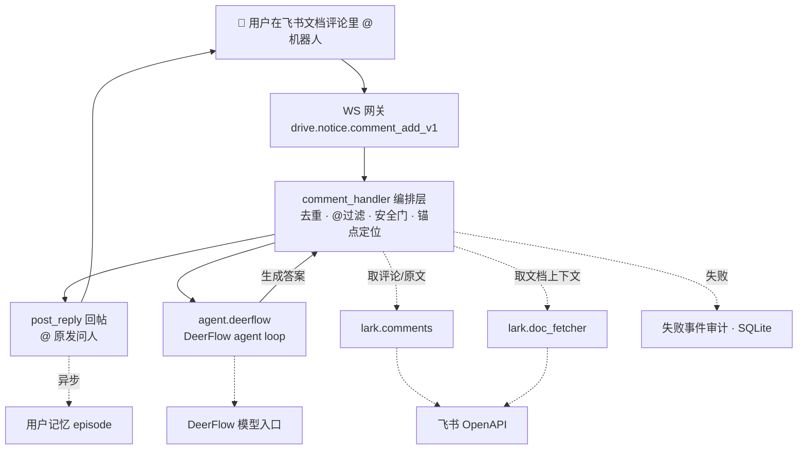

# lark-doc-whisper

[English](README.md) | 简体中文

[](LICENSE)
[](https://www.python.org/)
[](https://docs.astral.sh/uv/)
[](https://github.com/bytedance/deer-flow)

> **在飞书文档里 @ 一下，答案当场回到评论里——一个读得懂原文、也记得住你的 AI 助手。**

看文档看到一半有疑问，得切窗口问 AI、复制一大段原文、再手动交代「我说的是这一段」……你成了文档和 AI 之间来回跑的传令员。

lark-doc-whisper 让你**在评论里 @ 一下就直接问**：它自己看得懂你圈的是哪句、在聊什么，答案就回在这条评论下面。不用切窗口、不用复制粘贴、不用解释上下文。

> 本项目基于字节跳动开源的 [DeerFlow](https://github.com/bytedance/deer-flow) 构建——一个深度研究智能体框架。lark-doc-whisper 在其之上实现了飞书文档评论问答的接入、编排与安全边界。如果你喜欢这个项目，也不妨去给 DeerFlow 点个 star。

## ✨ 为什么你会喜欢它

- 💬 **问答不离开文档**：疑问就在原文旁边，答案也回在原文旁边，读和问在同一个地方完成，思路不断。
- ⚡ **@ 完就答**：不用等它定时来扫，你 @ 一下就即时回应，而且只看你问的这条，不去翻你其他评论。
- 🔐 **权限你说了算**：只在你把它拉进某篇文档时才生效，用不着一上来就交出一大把长期权限，不想用了随时请出去。
- 🎯 **答案贴着原文**：它顺着你圈的那句话去理解，看不够就自己往前后多读一点，而不是拿整篇瞎猜。
- 🧠 **安全地记住上下文**：同一篇文档里追着问，它接得上；每个用户 + 文档都有独立会话，不会和其他人或其他文档串上下文。
- 🔗 **能顺着链接看**：你贴的飞书文档或网页链接，它能读进来一起回答。
- 🛡️ **答不了也好好说话**：遇到越权、危险的请求它会拒绝；万一出岔子，也只会礼貌告诉你「稍后再来」，不会甩一堆看不懂的报错给你。
- 🧱 **站在稳定基座上**：底层 agent runtime 使用 DeerFlow harness，文档问答不是临时拼起来的 prompt wrapper，而是建立在生产可用的智能体底座之上。
- 🌙 **一直在，随时问**：它常驻在线、稳定运行，你半夜想起来问一句，它也在。

## 架构



会话 id 格式：`doc::<file_token>::user::<open_id>`。

完整的分层设计、并发与安全策略见 [架构说明](docs/lark_doc_whisper_architecture.zh-CN.md)。

## 环境要求

- Python >= 3.12（DeerFlow 硬约束）
- [uv](https://docs.astral.sh/uv/) 做依赖管理
- 构建时能访问 GitHub（DeerFlow harness 通过 `pyproject.toml` 的 `[tool.uv.sources]` 从
  `github.com/bytedance/deer-flow` 拉取，跟踪 main，**无需本地 checkout**）

## 快速开始

> ⚠️ 首次运行前（本地或生产都一样），先把仓库里所有 `__fill_me__` 占位符替换为真实值，否则模型首次调用就会 `openai.APIConnectionError`。快速自检：`grep -rn "__fill_me__" configs/ ~/.env`。

```bash
# 1. 安装依赖（deerflow-harness 从 git 拉取，uv.lock 已入库锁定版本）
uv sync

# 2. 填写密钥（LARK_APP_ID / LARK_APP_SECRET / LLM_API_KEY）
cp .env.example ~/.env             # 推荐：用户级，可跨项目复用
# 或项目级：cp .env.example configs/.env
# 加载顺序：configs/.env → ~/.env（见 config.py 的 ENV_CANDIDATES），取第一个存在的文件。
# 切勿把真实密钥提交进 git。
# 可选：设置 GITHUB_MCP_AUTHORIZATION="Bearer <token>"，启用 GitHub 官方 MCP 只读仓库工具。

# 3. DeerFlow 配置随仓库提供，位于 configs/deerflow.yaml
#    模型入口走 OpenAI 兼容协议，可接任意此类模型（Ark/Doubao、OpenAI、DeepSeek、本地 vLLM 等）；
#    填 model / base_url，密钥从环境变量 LLM_API_KEY 读取——按需修改。

# 4. 启动
uv run python -m lark_doc_whisper
```

生产部署（裸机 / VM + systemd）见完整运维手册：[docs/deploy\_sop.zh-CN.md](docs/deploy_sop.zh-CN.md)。

## 目录结构

```text
configs/                  # app.yaml + deerflow.yaml（密钥放 .env，不在这里）
src/lark_doc_whisper/     # 源码
deploy/                   # systemd unit 模板
runtime/                  # gitignore；日志 + 状态 + sqlite + deerflow workspace
docs/                     # 设计文档 + deploy_sop.md
tests/                    # 仅确定性单元测试
```

## 许可

Apache 2.0
