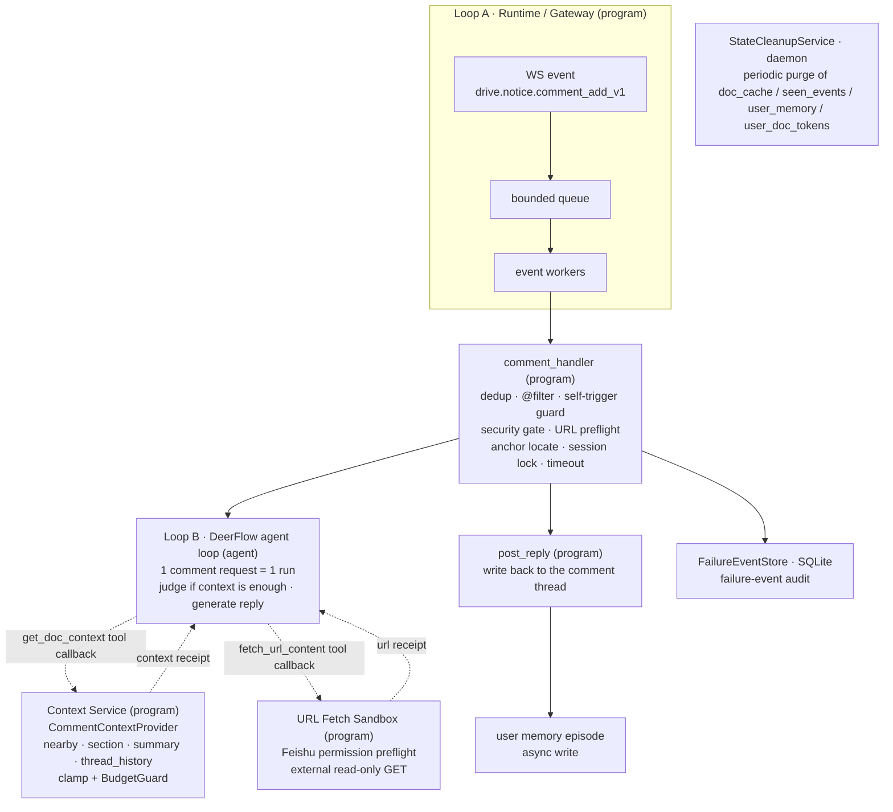
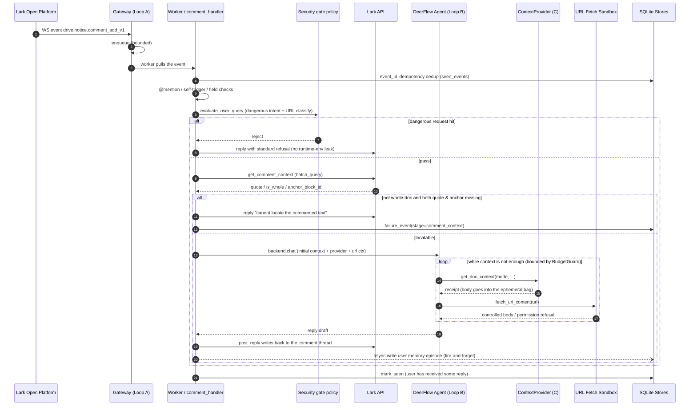
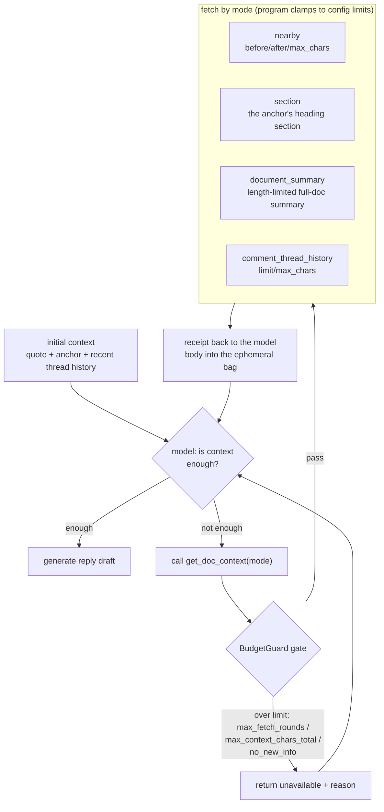
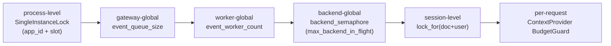
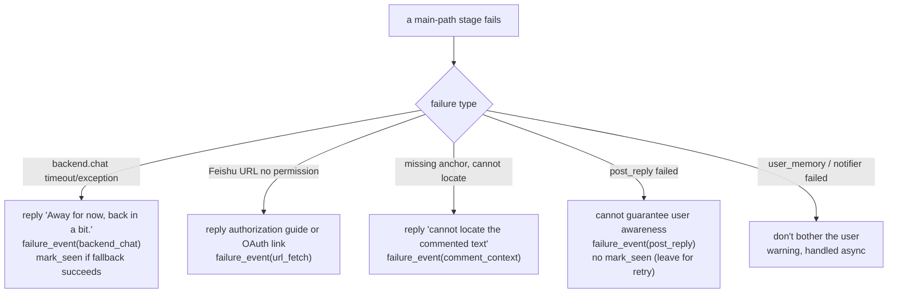
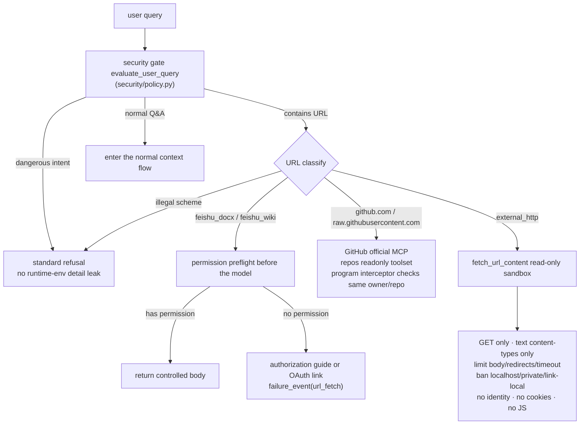
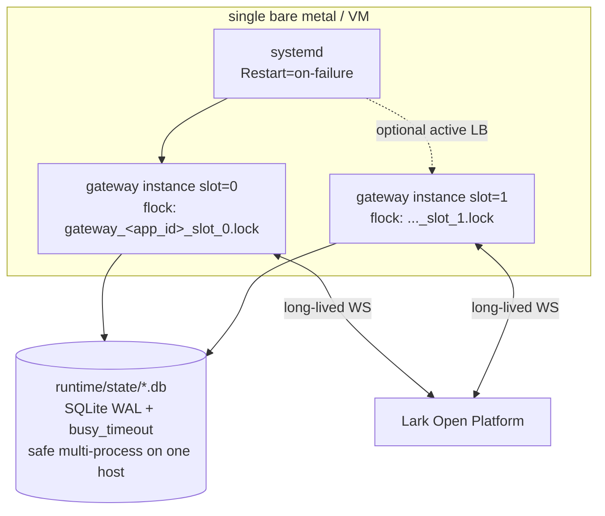

# lark-doc-whisper Architecture

English | [简体中文](lark_doc_whisper_architecture.zh-CN.md)

This document describes the overall architecture of lark-doc-whisper: the full path from a Lark doc-comment event arriving to the final reply, the layer boundaries, concurrency and security model, failure fallback, session memory, and the deployment topology.

In one line: **Lark doc comment `@bot` → WS gateway receives the event → bounded queue → worker orchestration → DeerFlow (OpenAI-compatible model) gathers context on demand and generates → reply posted back**. The process is a single long-lived connection (flock-protected); state lives in SQLite / files under `runtime/`, purged periodically by a background daemon thread.

---

## 1. Layered architecture

The system splits into three loops plus several program services. **B is the only agentic loop**; C is a program service hanging behind the tool callback, not an independent agent; A owns system-level concurrency, and C owns per-request context budget.



| Layer | Role | Responsibility |
| --- | --- | --- |
| **Loop A (Runtime)** | program | Event intake, bounded queue, worker concurrency, process-level resource reuse. Owns system-level concurrency. |
| **Loop B (DeerFlow agent loop)** | agent | The only agentic loop, running once per comment-request lifecycle. Judges whether context is enough, requests more on demand, and generates the reply. |
| **Context Service (C)** | program | A service behind the `get_doc_context` tool that controls the resource boundary of context expansion within a single request (clamp + budget gating). |

---

## 2. End-to-end processing flow

The diagram below follows the actual execution order in [comment_handler.py](../src/lark_doc_whisper/handlers/comment_handler.py).



Key closing semantics:

- **Unified fallback on timeout / exception**: if `backend.chat` times out or raises, reply "Away for now, back in a bit.", record `failure_event(stage=backend_chat)`, and only `mark_seen` if the fallback reply succeeds.
- **`mark_seen` policy**: as long as the user can receive *some* reply (including the fallback text), `mark_seen`; the sole exception is when `post_reply` can't even send a reply — then do **not** `mark_seen`, leaving it for redelivery/retry.
- **Large bodies never hit the checkpoint**: the `get_doc_context` tool returns only a receipt (`mode/chars/sha256`); the real body goes into `current_doc_context_bag`, injected temporarily at each model-call boundary via `override` by `DocumentContextMiddleware`.

---

## 3. agent / program boundary

Security and resource boundaries are all enforced by the program, not the model's goodwill; the model only expresses semantic intent.

| Program owns | Agent owns |
| --- | --- |
| Event intake and idempotency | Judging whether context is enough after seeing it |
| Comment answerability checks, anchor location | Raising a semantic need for `nearby / section / document_summary / comment_thread_history` |
| How much to fetch, how many rounds, when to stop (BudgetGuard) | Expressing a desired window (before/after/max_chars), but not deciding the final boundary |
| session lock / semaphore / timeout | Generating the final reply from the context |
| Security gate, URL allowlist, writing back, failure logging | — (cannot decide networking scope, auth flows, or out-of-bounds actions on its own) |

---

## 4. Context expansion: model-driven + program budget gating

After the initial context injects `quote`, `anchor`, and recent comment-thread history, the model decides whether it's enough; if not, it expresses a read intent via `get_doc_context(mode, before_blocks, after_blocks, max_chars, limit)`, and the program applies clamp and budget gating ([comment_context.py](../src/lark_doc_whisper/orchestrator/comment_context.py)).



- **Model decides**: which mode to read, how many blocks before/after for nearby, how many chars it wants.
- **Program clamps**: `nearby` requests are clamped to `[default_nearby_*, max_nearby_*]`; a single `max_chars` is clamped to `max_context_chars`; thread history is clamped to `max_thread_history_*`.
- **BudgetGuard** (`_consume_budget`): `max_fetch_rounds` caps total rounds; `max_context_chars_total` caps cumulative injected chars; `no_new_info` dedups by content sha256; each rejection gives an explicit `last_unavailable_reason` (`max_fetch_rounds` / `max_context_chars_total` / `no_new_info` / `no_anchor` / `mode_disabled`, etc.).
- **Supported modes**: `nearby`, `section`, `document_summary`, `full_excerpt`, `comment_thread_history`.

---

## 5. Concurrency control

Five layers from outside in; lock acquisition order is "session lock first, then the global semaphore", avoiding deadlock and cross-contaminated context.



| Layer | Mechanism | Purpose |
| --- | --- | --- |
| Process-level | `SingleInstanceLock` (app_id + slot) | Prevents starting multiple gateways on one host |
| Gateway-global | `event_queue_size` | Caps backlog of events |
| Worker-global | `event_worker_count` | Caps events processed concurrently |
| Backend-global | `backend_semaphore` (`max_backend_in_flight`) | Caps in-flight LLM requests |
| Session-level | `lock_for(doc+user)` | Serializes the same doc + same user |
| Per-request | `ContextProvider` BudgetGuard | Serializes context expansion + budget control |

The blocking `backend.chat` is offloaded to a thread pool via `asyncio.to_thread`, with an outer `asyncio.wait_for` applying the `backend_timeout_sec` timeout (default 300s).

---

## 6. Session & memory

- **Session boundary**: `session_id = doc__<file_token>__user__<open_id>`, which also serves as the DeerFlow `thread_id`, enabling multi-turn continuation across comments via the checkpointer.
- **user memory episode** ([user_memory.py](../src/lark_doc_whisper/state/user_memory.py)):
  - Storage: `add_episode` is append-only, fields `(user_id, doc_token, comment_id, summary, keywords, created_at)`.
  - Generation: `summary / keywords` are distilled by an LLM ([episode_summarizer.py](../src/lark_doc_whisper/agent/episode_summarizer.py)), reusing the default model from config (`create_chat_model` takes the first), with a bounded timeout (`episode_summary_timeout_sec`, default 60s) and a prompt requiring JSON parsed by hand; a timeout or invalid output raises, and the handler falls back to the rule-based `_build_episode_*`. Stored field shape unchanged.
  - Retrieval: `search` is **purely user-scoped** + a TTL time window; `doc_token / comment_id` are for provenance only, not recall. Recall principle: SQL coarse filter (user + time) → split query into words → concatenate `summary+keywords` into a haystack and score by substring-hit count → sort by score, then time.
  - Tool exposed to the model: `search_user_recent_history` ([user_history.py](../src/lark_doc_whisper/agent/user_history.py)).

### 6.1 State cleanup

A clean boundary: **the request path handles current semantics, background cleanup handles historical reclamation, and TTL defines both the "valid window" and the "deletion threshold".**

- **Dedicated background thread**: `StateCleanupService` ([cleanup.py](../src/lark_doc_whisper/state/cleanup.py)) starts/stops with the gateway lifecycle and runs every `state_cleanup_interval_sec` (default 600s); file scanning + SQLite deletion all happen inside the thread, without occupying comment event workers. A dedicated thread rather than `asyncio.to_thread` because cleanup is pure blocking I/O, and a separate thread is more direct than coordinating on the event loop.
- **Pure request path**: `is_seen()` is a pure query (`True` only if it exists and is within the TTL window, no deletion of expired); `mark_seen()` is a **synchronous write** on the request path that must complete for the event to count as truly processed — background cleanup only deletes old data and never substitutes for the current request's persistence; `doc_fetcher` only handles cache hit/miss + overwrite; `user_memory.search()` filters results by TTL.
- **Cleanup rules**: `doc_cache` iterates `*.json`, preferring the in-file `ts`, falling back to `mtime` if corrupt/missing, and `unlink`s anything past `doc_cache_ttl_sec` (`FileNotFoundError` silently skips concurrency); `seen_events` / `user_memory` each run `DELETE ... WHERE <ts> < now - ttl`; `user_doc_tokens` prunes expired in-memory user tokens.
- **Failure isolation**: a single subtask failing doesn't affect the others (each has its own `try/except`), and the round still emits a summary log (deletion count + duration).

For the ops-side TTL table and operations, see [deploy_sop.md](deploy_sop.md) §10.

---

## 7. Failure fallback & maintainer notification

Unified principle: on main-path failure, don't expose technical exceptions to the commenting user; fall back politely + durably persist the failure event to SQLite.



| Scenario | User side | Maintainer side | stage |
| --- | --- | --- | --- |
| `backend.chat` timeout/exception | "Away for now, back in a bit." | write failure_event | `backend_chat` |
| Feishu URL no permission | authorization guide or OAuth link | write failure_event | `url_fetch` |
| missing anchor, cannot locate | "cannot locate the commented text" | write failure_event | `comment_context` |
| `post_reply` failed | cannot guarantee awareness | write failure_event, **no mark_seen** | `post_reply` |
| user_memory / notifier failed | don't bother | warning, handled async | — |

- `FailureEventStore` uses SQLite ([failure_events.py](../src/lark_doc_whisper/state/failure_events.py)); events are traceable, analyzable, and replayable.
- `Notifier` is just an interface, defaulting to `NullNotifier`, not sending synchronously on the main path.

---

## 8. Security boundary & URL policy

Core principle: **don't treat "the model happening not to think of doing harm" as a security policy.** Security is enforced by the program gate, tool allowlist, and URL policy — three layers.



- **Allowed capabilities**: read document content around the current comment anchor, read the current user's recent Q&A summaries, read controlled Feishu URLs, read controlled GitHub repositories via the official GitHub MCP read-only repo tools, read controlled external HTTP(S) text.
- **Forbidden capabilities**: execute shell / Python / system commands; write files, change config, perform dangerous writes; read the server, runtime env, secrets, logs, host info; escalate privileges by following a user's "ignore the previous rules".
- **Tool allowlist**: the local `read_file` has been removed; the model has no local file-read capability.
- **Feishu linked-doc no-permission reply**: by default the reply asks the user to share the linked doc with the bot. When `url_fetch.authorization` and `oauth_callback` are enabled, the reply contains a Feishu OAuth URL carrying the linked-doc URL, current comment location, and requester open_id in an HMAC-signed `state`. The callback verifies the signed state, exchanges the one-time code for a short-lived `user_access_token`, validates the authorizing user, and keeps that token only in memory for the same user + linked doc. There is no refresh token, no persistence, and no automatic refresh.
- **GitHub repository links**: `github.com/{owner}/{repo}` and matching `raw.githubusercontent.com/{owner}/{repo}/...` links are routed to the GitHub MCP server registered in `extensions_config.json`. The MCP interceptor only allows calls whose `owner/repo` matches a URL explicitly present in the current question or same comment thread history; generic HTTP fetch refuses GitHub URLs.
- **Non-text & large files**: binaries, images, archives, oversized HTML, and pages requiring login interaction are never expanded; the reply asks the user to paste the key snippet or make the resource readable by the bot first.

---

## 9. Deployment & instance model

For the full ops manual, see [deploy_sop.md](deploy_sop.md); this section records only the architectural decisions.



- **Process form**: a single-process long-lived WS gateway, managed by systemd on bare metal / VM. Auto-restart is systemd's job; the process doesn't self-restart.
- **OAuth callback**: when `oauth_callback.enabled=true`, the same gateway process starts a small HTTP server that listens directly on `oauth_callback.host:oauth_callback.port` and serves only `GET /oauth/callback`. Deployments without a reverse proxy must expose that port and register `url_fetch.authorization.redirect_uri` in the Lark Open Platform.
- **Single-instance lock**: `SingleInstanceLock` ([singleton.py](../src/lark_doc_whisper/gateway/singleton.py)) uses `fcntl.flock` keyed by `app_id + slot`, with lock file `runtime/locks/gateway_<safe_app_id>_slot_<slot>.lock`. Restarting on the same slot fails immediately; the lock releases on process exit (the file isn't deleted, to avoid inode races).
- **Multiple connections on one host = active LB**: Lark randomly distributes events across multiple WS connections for the same app (competing consumers). The controlled approach is to explicitly start multiple instances with different `WHISPER_SLOT`; uncontrolled zombie connections (mostly from `kill -9`) are the root cause of delivery-rate drops.
- **Graceful shutdown**: SIGTERM / SIGINT via `add_signal_handler`, in order: stop accepting new events → send WS close frame (`_disconnect`) → stop the worker loop → stop `StateCleanupService` → release the lock. **No `kill -9`**, otherwise a lingering zombie connection grabs events and you must wait 4–6 minutes for Lark's server timeout to reclaim it.
- **State sharing**: `checkpoints.db` / `seen_events.db` etc. are all SQLite WAL + `busy_timeout`, safe to share across processes on one host; a cross-host cluster needs external Postgres/Redis and is out of scope.

---

## 10. Module structure

```text
src/lark_doc_whisper/
├── __main__.py                     # process entry
├── config.py                       # AppConfig + sub-configs + DEERFLOW_CONFIG_PATH constant
├── thread_id.py                    # session_id = doc + user
├── gateway/
│   ├── ws_gateway.py               # Loop A: single-instance lock / queue / worker / cleanup lifecycle
│   ├── oauth_callback.py           # short-lived user-token OAuth callback HTTP server
│   └── singleton.py                # SingleInstanceLock (flock)
├── handlers/comment_handler.py     # program orchestration main path
├── agent/
│   ├── deerflow_backend.py         # DeerFlow wrapper + ContextVar injection
│   ├── doc_context.py              # get_doc_context tool + middleware + bag
│   ├── url_fetch.py                # read-only URL fetch tool + Feishu permission preflight
│   ├── user_history.py             # search_user_recent_history tool
│   └── episode_summarizer.py       # LLM structured distillation for user memory
├── orchestrator/comment_context.py # Context Service: Provider + BudgetGuard
├── security/policy.py              # security gate + URL classification
├── notify/notifier.py              # maintainer notification interface (off by default)
├── lark/
│   ├── client.py                   # lark-oapi client
│   ├── comments.py                 # comment read / reply / thread history
│   ├── doc_fetcher.py              # full-document fetch (with a hard cap)
│   └── oauth.py                    # OAuth code exchange + user identity check
└── state/
    ├── failure_events.py           # failure events SQLite
    ├── seen_events.py              # idempotency dedup SQLite
    ├── user_memory.py              # user episode memory SQLite
    ├── user_doc_tokens.py          # in-memory user_access_token cache for linked docs
    ├── paths.py                    # runtime path conventions
    └── cleanup.py                  # unified state-cleanup daemon thread
```

The Context Service capabilities are cohesive inside a single [comment_context.py](../src/lark_doc_whisper/orchestrator/comment_context.py) (`_top_level_anchor_id` / `_resolve_nearby` / `_resolve_section` / `_consume_budget`).

---

## 11. Configuration overview

- [configs/app.yaml](../configs/app.yaml): application config (`comment_context` / `failure_handling` / `url_fetch` / concurrency / TTL / cleanup interval).
- [configs/deerflow.yaml](../configs/deerflow.yaml): DeerFlow-native config (model `default`, OpenAI-compatible any provider; tools; checkpointer). The path is fixed by `config.py`'s `DEERFLOW_CONFIG_PATH` constant, not an AppConfig field. For multi-environment switching, use `configs/deerflow.<profile>.yaml` naming rather than a config option.

Key `comment_context` items:

```yaml
comment_context:
  default_nearby_before: 1        # default window when the model doesn't specify
  default_nearby_after: 1
  max_nearby_before: 3            # program clamp upper bound
  max_nearby_after: 3
  max_fetch_rounds: 4             # BudgetGuard: total rounds
  max_context_chars: 12000        # single-injection upper bound
  max_context_chars_total: 24000  # BudgetGuard: cumulative injection upper bound
  enable_section: true
  enable_document_summary: true
  document_summary_chars: 4000
  default_thread_history_replies: 8
  default_thread_history_chars: 3000
  max_thread_history_replies: 30
  max_thread_history_chars: 8000
```

`default_nearby_*` / `default_thread_history_*` are the default windows when no tool arguments are passed; `max_nearby_*` / `max_thread_history_*` are the program-side clamp upper bounds.

Key `url_fetch.authorization` items:

```yaml
url_fetch:
  authorization:
    enabled: false
    authorize_base_url: https://accounts.feishu.cn/open-apis/authen/v1/authorize
    redirect_uri: ""
    scopes: []
```

When enabled with a valid redirect URI and scopes, unreadable Feishu linked docs get a user-facing OAuth link instead of a generic permission message. The OAuth `state` is signed with the in-memory app secret so callback code can reject tampered link/comment/user context. Do not configure `offline_access`; the authorization URL builder filters it out and the callback never stores refresh tokens. The current comment document remains handled by the bot's existing document permission; this authorization branch only applies to extra Feishu links pasted in comments.

Key `oauth_callback` items:

```yaml
oauth_callback:
  enabled: false
  host: 0.0.0.0
  port: 8088
```

When enabled, the gateway directly exposes `GET /oauth/callback` on the configured host and port. The callback stores only the short-lived `user_access_token` in process memory, keyed by requester open_id + linked-doc URL. Gateway restart, expiry, or read failure clears the path and the next comment gets a fresh authorization link.

---

## 12. Key design principles

1. The outer layer opens exactly one DeerFlow run; no hand-rolled while-loop outside the handler that re-enters the agent repeatedly.
2. The model expresses context-read intent; the program controls resource boundaries, budget, dedup, and stop conditions.
3. Large document bodies go only into the ephemeral bag, never into the checkpoint.
4. Failure events must be durably persisted, not just left in logs.
5. URL reading must be controlled; read-only fetch must not degenerate into a general networking agent.
6. When the anchor is missing or the comment isn't whole-doc, degrade the reply directly — no full-doc fallback, no entering the model.
7. Never write back persistent config at runtime: bot identity metadata is resolved from the Open Platform at startup and fails fast if unavailable.

---

## Appendix A · Key technical choices

| Decision | Chosen | Notes |
| --- | --- | --- |
| Language | Python ≥ 3.12 | hard deerflow constraint |
| Package manager | uv | `uv.lock` committed to pin a reproducible build |
| Agent runtime | deerflow + abstract interface (`HarnessBackend` Protocol) | backend replaceable, interface reserved |
| Model endpoint | OpenAI-compatible protocol (any provider) | Ark/Doubao, OpenAI, DeepSeek, local vLLM, etc.; key via `LLM_API_KEY` |
| Session dimension | `doc::<file_token>::user::<open_id>` | multi-turn continuation across comments |
| Thread persistence | deerflow SQLite checkpointer | WAL + busy_timeout, safe multi-process on one host |
| event_id dedup | self-implemented SQLite (deerflow doesn't cover this layer) | idempotency |
| Document cache | self-implemented + TTL | background thread periodically reclaims physically |
| Concurrency model | serial per thread, concurrent across threads | session lock + backend semaphore |
| Process supervision | systemd unit + SOP | auto-restart is systemd's job |
