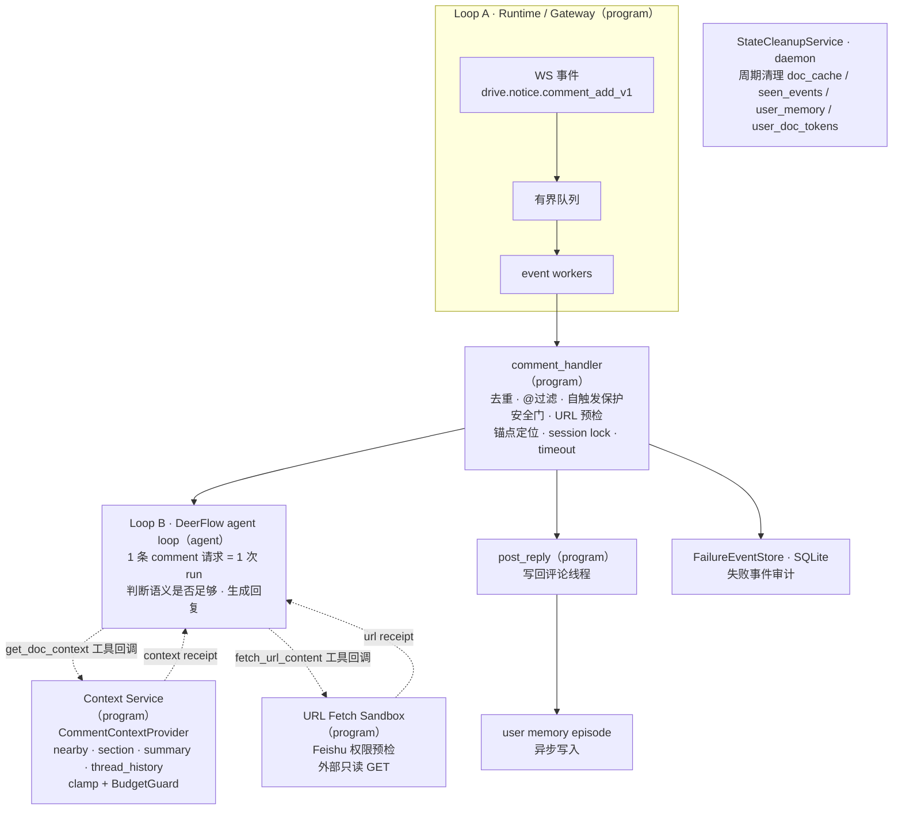
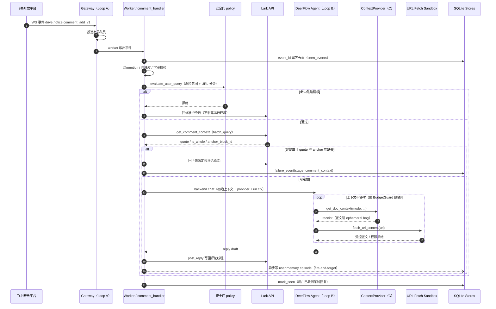
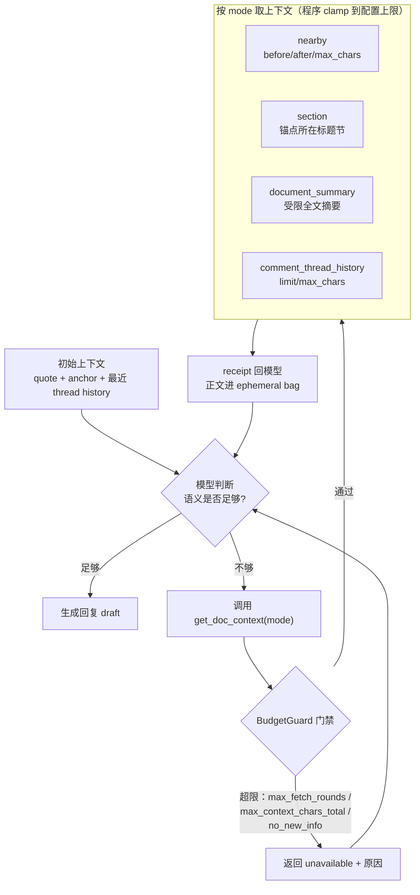
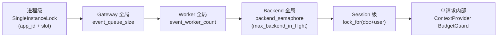
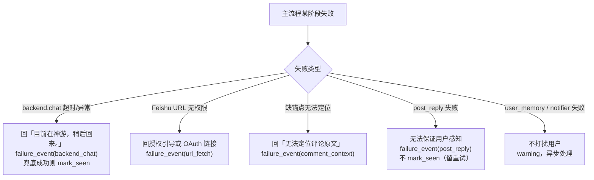
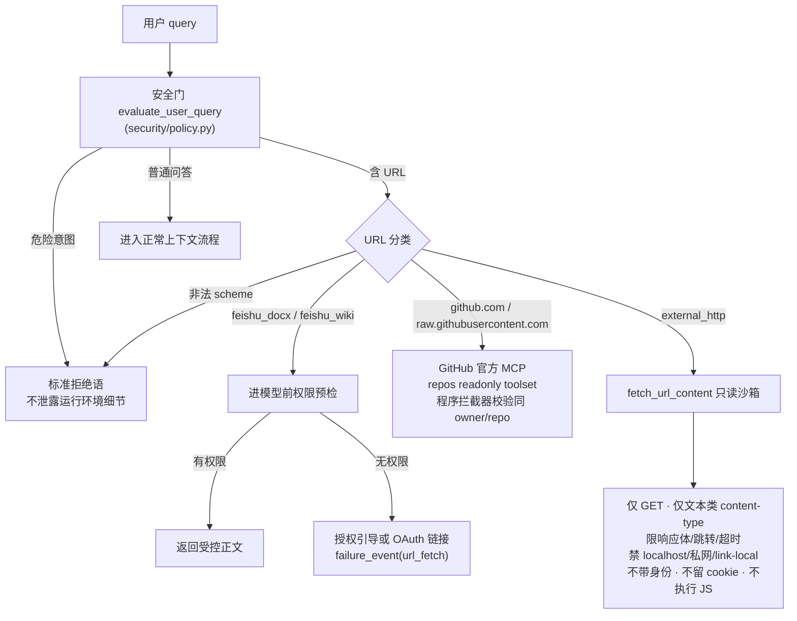
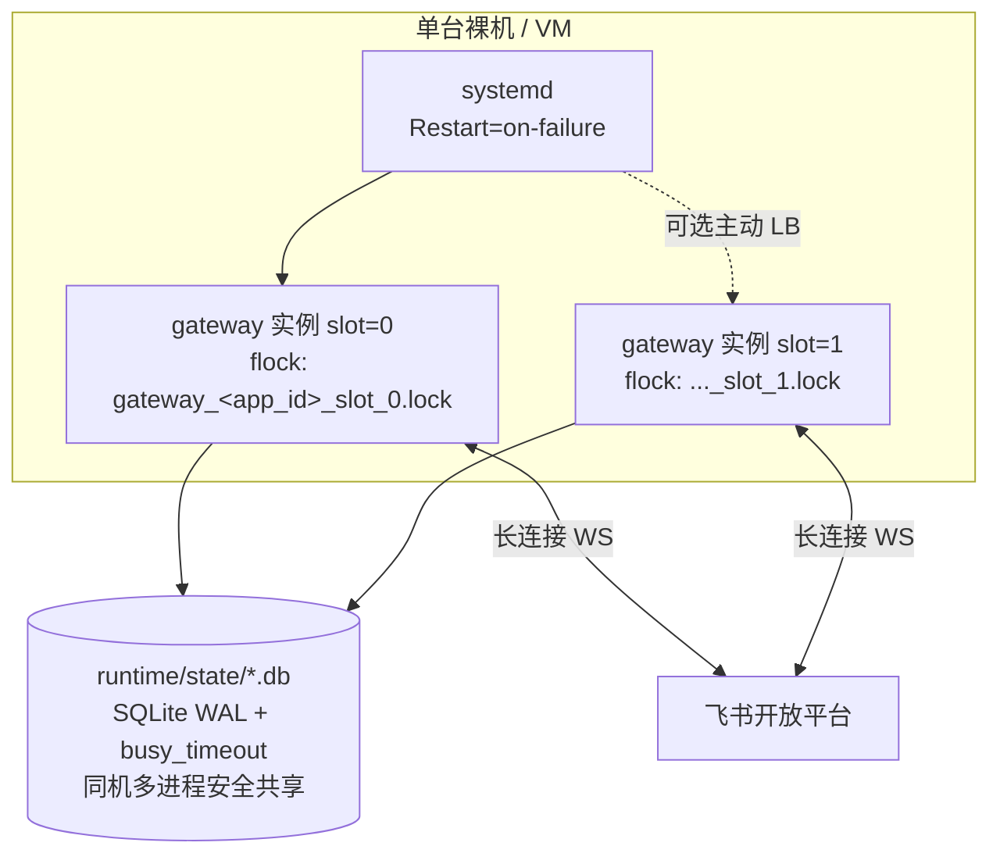

# lark-doc-whisper 架构说明

[English](lark_doc_whisper_architecture.md) | 简体中文

本文描述 lark-doc-whisper 的整体架构：从飞书文档评论事件进入，到最终回帖的完整链路、分层边界、并发与安全策略、失败兜底、会话记忆与部署形态。

一句话概括：**飞书文档评论 `@bot` → WS gateway 收事件 → 有界队列 → worker 编排 → DeerFlow(OpenAI 兼容模型) 按需取上下文生成 → 回帖**。进程为单实例长连接（flock 保护），状态落在 `runtime/` 下的 SQLite / 文件，由后台守护线程周期清理。

---

## 1. 分层架构

系统分为三层循环 + 若干 program 服务。**B 是唯一的 agentic loop**；C 是挂在工具回调背后的 program 服务，不是独立 agent；A 负责系统级并发，C 负责单请求上下文预算。



| 层 | 角色 | 职责 |
| --- | --- | --- |
| **Loop A（Runtime）** | program | 事件接入、有界队列、worker 并发、进程级资源复用。管系统级并发。 |
| **Loop B（DeerFlow agent loop）** | agent | 唯一 agentic loop，单条 comment 请求生命周期内运行一次。判断语义是否足够、按需请求上下文、生成回复。 |
| **Context Service（C）** | program | 挂在 `get_doc_context` 工具背后的服务，控制单请求内上下文扩展的资源边界（clamp + 预算门禁）。 |

---

## 2. 端到端处理流程

下图对应 [comment_handler.py](../src/lark_doc_whisper/handlers/comment_handler.py) 的实际执行顺序。



关键收口语义：

- **超时 / 异常统一兜底**：`backend.chat` 超时或异常，回「目前在神游，稍后回来。」，记 `failure_event(stage=backend_chat)`，兜底回帖成功才 `mark_seen`。
- **`mark_seen` 策略**：只要用户能收到某种回复（含兜底文案）就 `mark_seen`；唯独 `post_reply` 连回复都发不出去时**不** `mark_seen`，留给重投重试。
- **大段正文不落 checkpoint**：`get_doc_context` 工具只回 receipt（`mode/chars/sha256`），真实正文进 `current_doc_context_bag`，由 `DocumentContextMiddleware` 在每次模型调用边界用 `override` 临时注入。

---

## 3. agent / program 边界

安全与资源边界一律由 program 收口，不依赖模型自觉；模型只表达语义意图。

| Program 负责 | Agent 负责 |
| --- | --- |
| 事件接入与幂等 | 看到上下文后判断语义是否足够 |
| comment 可回复性校验、锚点定位 | 提出 `nearby / section / document_summary / comment_thread_history` 的语义需求 |
| 取多少、扩几轮、何时停止（BudgetGuard） | 表达期望窗口（before/after/max_chars），但不决定最终边界 |
| session lock / semaphore / timeout | 基于上下文生成最终 reply |
| 安全门、URL 白名单、写回评论、失败落库 | —（不能自行决定联网范围、认证流程或越权动作） |

---

## 4. 上下文扩展：模型驱动 + 程序预算门禁

初始上下文注入 `quote`、`anchor`、最近评论线程历史后，模型自行判断是否足够；不够则通过 `get_doc_context(mode, before_blocks, after_blocks, max_chars, limit)` 表达读取意图，程序执行 clamp 与预算门禁（[comment_context.py](../src/lark_doc_whisper/orchestrator/comment_context.py)）。



- **模型决定**：读哪种 mode、nearby 前后各多少 block、期望多少字符。
- **程序 clamp**：`nearby` 请求夹到 `[default_nearby_*, max_nearby_*]`；单次 `max_chars` 夹到 `max_context_chars`；thread history 夹到 `max_thread_history_*`。
- **BudgetGuard**（`_consume_budget`）：`max_fetch_rounds` 限总轮次；`max_context_chars_total` 限累计注入字符；`no_new_info` 按内容 sha256 去重；每次拒绝给出明确 `last_unavailable_reason`（`max_fetch_rounds` / `max_context_chars_total` / `no_new_info` / `no_anchor` / `mode_disabled` 等）。
- **支持的 mode**：`nearby`、`section`、`document_summary`、`full_excerpt`、`comment_thread_history`。

---

## 5. 并发控制

自外向内共五层，锁获取顺序为「先 session 锁，后全局信号量」，避免死锁与上下文互相污染。



| 层级 | 机制 | 作用 |
| --- | --- | --- |
| 进程级 | `SingleInstanceLock`（app_id + slot） | 防止同机重复启动多个 gateway |
| Gateway 全局 | `event_queue_size` | 限制堆积事件数 |
| Worker 全局 | `event_worker_count` | 限制同时处理事件数 |
| Backend 全局 | `backend_semaphore`（`max_backend_in_flight`） | 限制在跑的 LLM 请求数 |
| Session 级 | `lock_for(doc+user)` | 同文档同用户串行 |
| 单请求内部 | `ContextProvider` BudgetGuard | 上下文扩展串行 + 预算控制 |

同步阻塞的 `backend.chat` 通过 `asyncio.to_thread` 甩到线程池，外层 `asyncio.wait_for` 施加 `backend_timeout_sec` 超时（默认 300s）。

---

## 6. 会话与记忆

- **会话边界**：`session_id = doc__<file_token>__user__<open_id>`，同时作为 DeerFlow `thread_id`，配合 checkpointer 实现跨评论多轮续接。
- **user memory episode**（[user_memory.py](../src/lark_doc_whisper/state/user_memory.py)）：
  - 存储：`add_episode` append-only，字段 `(user_id, doc_token, comment_id, summary, keywords, created_at)`。
  - 生成：`summary / keywords` 由 LLM 结构化提炼（[episode_summarizer.py](../src/lark_doc_whisper/agent/episode_summarizer.py)），复用配置里的默认模型（`create_chat_model` 取第一个）、有界超时（`episode_summary_timeout_sec`，默认 60s）、prompt 要求 JSON 手动解析；超时或非法输出即抛异常，由 handler 回退到规则版 `_build_episode_*`。存储字段形状不变。
  - 检索：`search` 为**纯 user 维度** + TTL 时间窗；`doc_token / comment_id` 仅作溯源，不参与召回。召回原理：SQL 粗筛（user + 时间）→ 查询词按空格分词 → `summary+keywords` 拼成 haystack 做子串命中计数打分 → 按分数、时间排序。
  - 暴露给模型的工具：`search_user_recent_history`（[user_history.py](../src/lark_doc_whisper/agent/user_history.py)）。

### 6.1 状态清理

清晰边界：**请求路径负责当前语义，后台清理负责历史回收，TTL 同时定义「有效窗口」和「删除阈值」**。

- **独立后台线程**：`StateCleanupService`（[cleanup.py](../src/lark_doc_whisper/state/cleanup.py)）随 gateway 生命周期启停，`state_cleanup_interval_sec`（默认 600s）周期跑一次，文件扫描 + SQLite 删除都在线程内完成，不占用 comment event worker。选独立线程而非 `asyncio.to_thread`，因为清理是纯阻塞 I/O，独立线程比在 event loop 上协调更直接。
- **请求路径纯净**：`is_seen()` 是纯查询（存在且在 TTL 窗口内才为 `True`，过期不删）；`mark_seen()` 是请求链**同步写入**，必须完成才算事件真正处理完，后台清理只删旧数据、不替代当前请求落库；`doc_fetcher` 只管 cache hit/miss + 覆盖写；`user_memory.search()` 按 TTL 过滤查询结果。
- **清理规则**：`doc_cache` 遍历 `*.json`，优先读文件内 `ts`，损坏/缺失回退 `mtime`，超 `doc_cache_ttl_sec` 即 `unlink`（`FileNotFoundError` 静默跳过并发）；`seen_events` / `user_memory` 各执行 `DELETE ... WHERE <ts> < now - ttl`；`user_doc_tokens` 清理过期的内存用户 token。
- **失败隔离**：单子任务失败不影响其他子任务（各自 `try/except`），本轮仍输出 summary log（删除数量 + 耗时）。

运维视角的 TTL 表格与操作见 [deploy_sop.zh-CN.md](deploy_sop.zh-CN.md) §10。

---

## 7. 失败兜底与维护者通知

统一原则：主流程失败不把技术异常暴露给评论用户，礼貌兜底 + 失败事件 durable 落 SQLite。



| 场景 | 用户侧 | 维护侧 | stage |
| --- | --- | --- | --- |
| `backend.chat` 超时/异常 | 「目前在神游，稍后回来。」 | 写 failure_event | `backend_chat` |
| Feishu URL 无权限 | 授权引导或 OAuth 链接 | 写 failure_event | `url_fetch` |
| 缺锚点无法定位 | 「无法定位评论原文」 | 写 failure_event | `comment_context` |
| `post_reply` 失败 | 无法保证感知 | 写 failure_event，**不 mark_seen** | `post_reply` |
| user_memory / notifier 失败 | 不打扰 | warning，异步处理 | — |

- `FailureEventStore` 用 SQLite（[failure_events.py](../src/lark_doc_whisper/state/failure_events.py)），事件可追踪、可分析、可重放。
- `Notifier` 是一层接口，默认 `NullNotifier`，不在主链路同步发送。

---

## 8. 安全边界与 URL 策略

核心原则：**不要把「模型当前没想到作恶」当成安全策略。** 安全由 program gate、工具白名单、URL policy 三道收口。



- **允许的能力**：读当前评论锚点相关文档内容、读当前用户近期问答摘要、读受控 Feishu URL、通过 GitHub 官方 MCP 只读仓库工具读取受控 GitHub 仓库、读受控外部 HTTP(S) 文本。
- **禁止的能力**：执行 shell / Python / 系统命令；写文件、改配置、发起危险写操作；读服务器、运行环境、密钥、日志、宿主机信息；按用户指令「忽略前面规则」越权扩权。
- **工具白名单**：已移除本地 `read_file`，模型不具备本地文件读取能力。
- **Feishu 链接文档无权限回复语**：默认回复会要求用户把链接文档共享给机器人。启用 `url_fetch.authorization` 与 `oauth_callback` 后，回复会包含飞书 OAuth 链接，并在 HMAC 签名的 `state` 中携带链接文档 URL、当前评论位置和提问用户 open_id。callback 校验签名 state，用一次性 code 换短期 `user_access_token`，校验授权用户身份，然后只在内存中按「同一用户 + 同一链接文档」缓存该 token。无 refresh token、无持久化、无自动刷新。
- **GitHub 仓库链接**：`github.com/{owner}/{repo}` 以及匹配的 `raw.githubusercontent.com/{owner}/{repo}/...` 链接会路由到 `extensions_config.json` 注册的 GitHub MCP server。MCP 拦截器只允许访问当前问题或同评论线程历史中明确出现过的 `owner/repo`；generic HTTP fetch 会拒绝 GitHub URL。
- **非文本与大文件**：二进制、图片、压缩包、超大 HTML、需登录交互的页面一律不展开，回复用户请贴关键片段或先让资源对机器人可读。

---

## 9. 部署与实例模型

完整操作手册见 [deploy_sop.zh-CN.md](deploy_sop.zh-CN.md)，此处只记录架构决策。



- **进程形态**：单进程长连接 WS gateway，裸机 / VM + systemd 托管。自动重启是 systemd 职责，进程内不自重启。
- **OAuth callback**：当 `oauth_callback.enabled=true` 时，同一个 gateway 进程启动一个小型 HTTP server，直接监听 `oauth_callback.host:oauth_callback.port`，仅响应 `GET /oauth/callback`。无反向代理部署时，需要直接放行该端口，并在飞书开放平台登记 `url_fetch.authorization.redirect_uri`。
- **单实例锁**：`SingleInstanceLock`（[singleton.py](../src/lark_doc_whisper/gateway/singleton.py)）用 `fcntl.flock` 按 `app_id + slot` 加锁，锁文件 `runtime/locks/gateway_<safe_app_id>_slot_<slot>.lock`。同 slot 重复启动直接失败；进程退出即释放（不删锁文件，避免 inode 竞态）。
- **同机多连接 = 主动 LB**：飞书对同 app 的多条 WS 连接做事件随机分发（竞争消费者）。受控做法是用不同 `WHISPER_SLOT` 显式启多个实例；非受控的僵尸连接（多来自 `kill -9`）是收到率下降的根因。
- **优雅关闭**：SIGTERM / SIGINT 经 `add_signal_handler` 触发，顺序为停收新事件 → 发 WS close frame（`_disconnect`）→ 停 worker loop → 停 `StateCleanupService` → 释放锁。**禁止 `kill -9`**，否则残留僵尸连接抢事件，需等飞书 server 4–6 分钟超时回收。
- **状态共享**：`checkpoints.db` / `seen_events.db` 等均 SQLite WAL + `busy_timeout`，同机多进程安全共享；跨机集群需外置 Postgres/Redis，不在当前范围。

---

## 10. 模块结构

```
src/lark_doc_whisper/
├── __main__.py                     # 进程入口
├── config.py                       # AppConfig + 子配置 + DEERFLOW_CONFIG_PATH 常量
├── thread_id.py                    # session_id = doc + user
├── gateway/
│   ├── ws_gateway.py               # Loop A：单实例锁 / queue / worker / cleanup 启停
│   ├── oauth_callback.py           # 短期 user token OAuth callback HTTP server
│   └── singleton.py                # SingleInstanceLock（flock）
├── handlers/comment_handler.py     # program 编排主链路
├── agent/
│   ├── deerflow_backend.py         # DeerFlow 封装 + ContextVar 注入
│   ├── doc_context.py              # get_doc_context 工具 + middleware + bag
│   ├── url_fetch.py                # 只读 URL fetch 工具 + Feishu 权限预检
│   ├── user_history.py             # search_user_recent_history 工具
│   └── episode_summarizer.py       # LLM 结构化提炼 user memory
├── orchestrator/comment_context.py # Context Service：Provider + BudgetGuard
├── security/policy.py              # 安全门 + URL 分类
├── notify/notifier.py              # 维护者通知接口（默认 off）
├── lark/
│   ├── client.py                   # lark-oapi client
│   ├── comments.py                 # 评论读取 / 回帖 / 线程历史
│   ├── doc_fetcher.py              # 文档全文抓取（含硬上限）
│   └── oauth.py                    # OAuth code 换 token + 用户身份校验
└── state/
    ├── failure_events.py           # 失败事件 SQLite
    ├── seen_events.py              # 幂等去重 SQLite
    ├── user_memory.py              # 用户 episode 记忆 SQLite
    ├── user_doc_tokens.py          # 链接文档 user_access_token 内存缓存
    ├── paths.py                    # runtime 路径约定
    └── cleanup.py                  # 统一状态清理守护线程
```

Context Service 的能力内聚在单个 [comment_context.py](../src/lark_doc_whisper/orchestrator/comment_context.py) 内（`_top_level_anchor_id` / `_resolve_nearby` / `_resolve_section` / `_consume_budget`）。

---

## 11. 配置总览

- [configs/app.yaml](../configs/app.yaml)：应用配置（`comment_context` / `failure_handling` / `url_fetch` / 并发 / TTL / cleanup 间隔）。
- [configs/deerflow.yaml](../configs/deerflow.yaml)：DeerFlow 原生配置（模型 `default`，OpenAI 兼容任意厂商；tools；checkpointer）。路径由 `config.py` 的 `DEERFLOW_CONFIG_PATH` 常量固定，不作为 AppConfig 字段。多环境切换走 `configs/deerflow.<profile>.yaml` 命名，而非配置项。

`comment_context` 关键项：

```yaml
comment_context:
  default_nearby_before: 1        # 模型未指定时的默认窗口
  default_nearby_after: 1
  max_nearby_before: 3            # 程序 clamp 上限
  max_nearby_after: 3
  max_fetch_rounds: 4             # BudgetGuard：总轮次
  max_context_chars: 12000        # 单次注入上限
  max_context_chars_total: 24000  # BudgetGuard：累计注入上限
  enable_section: true
  enable_document_summary: true
  document_summary_chars: 4000
  default_thread_history_replies: 8
  default_thread_history_chars: 3000
  max_thread_history_replies: 30
  max_thread_history_chars: 8000
```

`default_nearby_*` / `default_thread_history_*` 是未传工具参数时的默认窗口；`max_nearby_*` / `max_thread_history_*` 是程序侧 clamp 上限。

`url_fetch.authorization` 关键项：

```yaml
url_fetch:
  authorization:
    enabled: false
    authorize_base_url: https://accounts.feishu.cn/open-apis/authen/v1/authorize
    redirect_uri: ""
    scopes: []
```

启用并配置合法 redirect URI 与 scopes 后，无法读取的飞书链接文档会收到用户可点击的 OAuth 授权链接，而不是泛化权限提示。OAuth `state` 使用内存中的 app secret 签名，便于 callback 代码拒绝被篡改的链接、评论和用户上下文。不要配置 `offline_access`；授权链接生成时会过滤它，callback 也不会保存 refresh token。当前评论所在文档仍沿用 bot 已有文档权限；该授权分支只作用于评论中新贴的额外飞书链接。

`oauth_callback` 关键项：

```yaml
oauth_callback:
  enabled: false
  host: 0.0.0.0
  port: 8088
```

启用后，gateway 会在配置的 host/port 直接暴露 `GET /oauth/callback`。callback 只把短期 `user_access_token` 存在进程内存中，key 为提问用户 open_id + 链接文档 URL。gateway 重启、token 过期或读取失败后，该路径失效，下次评论会重新给授权链接。

---

## 12. 关键设计原则

1. 外层只开一次 DeerFlow run，不在 handler 外手搓 while-loop 反复重进 agent。
2. 模型表达上下文读取意图，program 控制资源边界、预算、去重和停止条件。
3. 大段文档内容只进 ephemeral bag，不写 checkpoint。
4. 失败事件必须 durable 落盘，不只存在日志里。
5. URL 读取必须受控，只读 fetch 不能退化成通用联网 agent。
6. 缺锚点、非整篇评论时直接降级回复，不 fallback 全文、不进模型。
7. 不在运行时回写持久化配置：机器人身份等运行期元信息在启动时从开放平台解析，解析失败即 fail-fast。

---

## 附录 A · 关键技术选型

| 决策 | 选定 | 说明 |
| --- | --- | --- |
| 语言 | Python ≥ 3.12 | deerflow 硬约束 |
| 包管理 | uv | `uv.lock` 入库锁定可复现构建 |
| Agent runtime | deerflow + 抽象接口（`HarnessBackend` Protocol） | backend 可替换，接口留位 |
| 模型端点 | OpenAI 兼容协议（任意厂商） | Ark/Doubao、OpenAI、DeepSeek、本地 vLLM 等均可，密钥走 `LLM_API_KEY` |
| session 维度 | `doc::<file_token>::user::<open_id>` | 跨评论多轮续接 |
| Thread 持久化 | deerflow SQLite checkpointer | WAL + busy_timeout，同机多进程安全 |
| event_id 去重 | 自实现 SQLite（deerflow 不管这层） | 幂等 |
| 文档缓存 | 自实现 + TTL | 后台线程周期物理回收 |
| 并发模型 | 同 thread 串行、跨 thread 并发 | session lock + backend semaphore |
| 进程守护 | systemd unit + SOP | 自动重启是 systemd 职责 |
